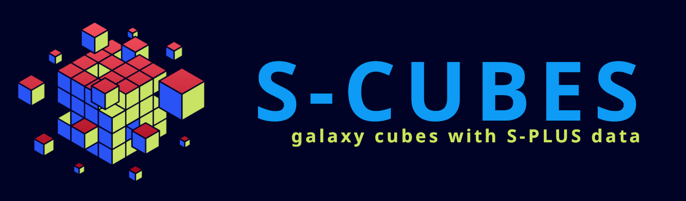

|version| |workflow| |license| |docs| |doi|

S-Cubes is a python package designed to make galaxy cubes (X, Y, Lambda) with S-PLUS data. 
The S-Cubes repository includes the scubes python package which allows the users to create 
their own codes. It also includes the data files to calibrate stamps with iDR4 zero-points 
correction and SExtractor to identify stars along the stamp (optionally).

**Online Documentation:** `<https://splus-collab.github.io/s-cubes/>`__

.. _require:

Requirements
------------

-  Python 3.8
-  **SExtractor** installed either *locally* or *system-wide*
-  An user account at `S-PLUS Cloud <https://splus.cloud/>`__ in order
   to access the necessary data.

.. _install:

Installation
------------

Clone the project:

.. code:: console

   git clone https://github.com/splus-collab/s-cubes.git
   
*(optional)* Create and activate a virtual enviroment for the package
instalation and usage:

.. code:: console

   python3 -m venv .venv
   source .venv/bin/activate

Install S-Cubes:

.. code:: console

   pip install .

.. _scripts:

Entry-point scripts
-------------------

This package includes various entry-point command-line scripts for 
different tasks. They are: ``scubes``, ``scubesml``, ``get_lupton_RGB``,
``sex_mask_stars``, ``sex_mask_stars_cube``, ``mltoheader`` and
``scubes_filters``. In order to obtain a detailed description and the 
script usage run them with **–help** argument. 

.. _example:

``scubes`` Running example
..........................

This example will create a **500x500** pixels cube with the 
12-bands images from **S-PLUS TILE HYDRA-0045** for the *NGC3312* 
galaxy. The fluxes and errors are calculated based on the 
calibration of the zero points of **S-PLUS iDR4** (*data package 
included*), but they are **not corrected for Galactic extinction**.

The stamps are made centered at coordinates RA *10h37m02.5s* and DEC
*-27d33’56"*. The input values of RA and DEC will be converted to 
degrees using the :meth:`scubes.utilities.io.convert_coord_to_degrees`. 
It accepts hourangle (using *hms* divisors, ex: *10h37m2.5s*) and 
degrees (using *:* or *dms* divisords, ex: *10:37:2.5* or *10d37m2.5s*).
Note that *10h37m2.5s* (*159.26 deg*) is a totally different angle from 
*10:37:2.5* (*10.62 deg*).

The resultant files will be created at directory *workdir*.

The call to the entry-point script ``scubes`` to this example would be:

.. code:: console

   scubes -w workdir -l 500 -- HYDRA-0045 10h37m02.5s -27d33\'56\" NGC3312

.. _license:

License
-------

This code is distributed under the `GNU GENERAL PUBLIC LICENSE
v3.0 <LICENSE>`__. Please refer to the ``LICENSE.txt`` file in the
repository for more details.

.. |version| image:: https://img.shields.io/github/v/tag/splus-collab/s-cubes?include_prereleases&label=version
   :alt: S-Cubes version
   :target: https://github.com/splus-collab/s-cubes

.. |workflow| image:: https://github.com/splus-collab/s-cubes/actions/workflows/docs_deploy.yml/badge.svg
   :alt: Docs build deployment
   :target: https://github.com/splus-collab/s-cubes/blob/main/.github/workflows/docs_deploy.yml 

.. |license| image:: https://img.shields.io/github/license/splus-collab/s-cubes
   :alt: License
   :target: https://github.com/splus-collab/s-cubes/blob/main/LICENSE.txt
   
.. |docs| image:: https://img.shields.io/website?url=https%3A%2F%2Fsplus%2Dcollab.github.io%2Fs-cubes%2F
   :alt: S-Cubes website
   :target: https://splus-collab.github.io/s-cubes/index.html

.. |doi| image:: https://zenodo.org/badge/DOI/10.5281/zenodo.18417114.svg
   :alt: DOI
   :target: https://doi.org/10.5281/zenodo.18417114
