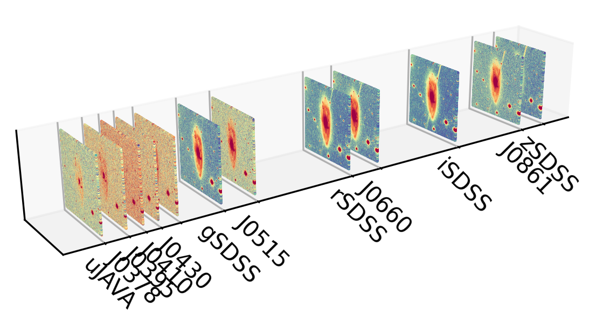

.. S-Cubes documentation master file, created by
   sphinx-quickstart on Tue Jan 16 14:10:33 2024.
   You can adapt this file completely to your liking, but it should at least
   contain the root `toctree` directive.

S-Cubes homepage
================

.. image:: https://img.shields.io/github/v/tag/splus-collab/s-cubes?include_prereleases&label=version
   :target: https://github.com/splus-collab/s-cubes
   :alt: GitHub Tag

.. image:: https://img.shields.io/github/actions/workflow/status/splus-collab/s-cubes/.github%2Fworkflows%2Fdocs_deploy.yml?label=gh-pages
   :target: https://github.com/splus-collab/s-cubes/blob/main/.github/workflows/docs_deploy.yml 
   :alt: GitHub Actions Workflow Status

.. image:: https://img.shields.io/github/license/splus-collab/s-cubes
   :target: https://github.com/splus-collab/s-cubes/blob/main/LICENSE.txt
   :alt: GitHub License

.. image:: https://zenodo.org/badge/DOI/10.5281/zenodo.18417114.svg
   :target: https://doi.org/10.5281/zenodo.18417114
   :alt: DOI

.. toctree::
   :maxdepth: 2
   :glob:
   :caption: Documentation

   gstart
   makecube
   ep

.. toctree::
   :maxdepth: 2
   :glob:
   :caption: Running examples
   
   nb_example
   mask_stars_example
   masterlist_example

.. toctree::
   :maxdepth: 2
   :glob:
   :caption: Package

   scubes
   
Indices and tables
==================

* :ref:`genindex`
* :ref:`modindex`
* :ref:`search`
