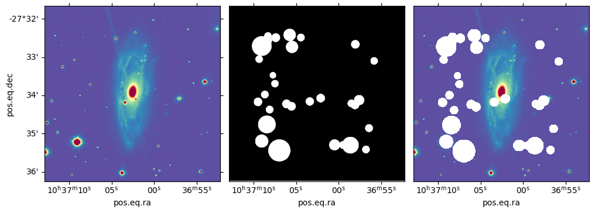

.. _jupyter_mask_stars:

Mask stars with ``scubes`` package
==================================

:download:`Download this notebook <mask_stars_example.ipynb>`.

.. toctree::
    :maxdepth: 2
    :glob:

``scubes`` package implements some ways to create a star mask for a
selected stamp. The program uses
`source-extractor <https://www.astromatic.net/software/sextractor/>`__
to create the mask and depends on a series of dedicated options.

Before the **SCUBE** created, one can choose two ways to create a stars
mask:

1. ``scubes`` script has the option to include the source extractor (–mask_stars option);
2. ``sex_mask_stars`` script: Another script implemented by ``scubes`` 
   package which creates a stars mask either using RA, DEC, TILE and
   SIZE options.

After the **SCUBE** generated, one can use two other options to create a
stars mask: 

1. ``sex_mask_stars_cube`` script, or; 
2. reading a cube with ``scubes.utilities.read_scube`` class and using the method
   ``source_extractor()``.

The console scripts (``scubes``, ``sex_mask_stars`` and
``sex_mask_stars_cube``) allow the user to interact with the mask
process. By using the option ``--no_interact`` the user can turn off the
interaction with the mask process (inn order to create non-assisted
runs). At the end the script generates a 2D mask FITS file, together
with the S-PLUS data detection image and some **source-extractor**
metadata files (2d segmentation fits, catalogs and logs). Also, a image
of the detection is created. Here we show an example using
``sex_mask_stars`` script without interaction:

.. code:: ipython3

    !sex_mask_stars --help

.. parsed-literal::

    usage: sex_mask_stars [-h] [-l SIZE] [-x SEXTRACTOR] [-v] [-p CLASS_STAR] [-f]
                          [-N] [-S SATUR_LEVEL] [-B BACK_SIZE] [-T DETECT_THRESH]
                          [-U USERNAME] [-P PASSWORD] [-F] [-b BANDS]
                          [-g GALAXY_NAME]
                          SPLUS_TILE RA DEC
    
    ┌─┐   ┌─┐┬ ┬┌┐ ┌─┐┌─┐  | sex_mask_stars entry-point script:
    └─┐───│  │ │├┴┐├┤ └─┐  | Uses S-PLUS detection image and SExtractor 
    └─┘   └─┘└─┘└─┘└─┘└─┘  | to identify stars on the FOV. 
    ---------------------- + 
    
       Eduardo Alberto Duarte Lacerda <dhubax@gmail.com>, Fabio Herpich <fabiorafaelh@gmail.com>
    
    positional arguments:
      SPLUS_TILE                  Name of the S-PLUS tile
      RA                          Galaxy's right ascension
      DEC                         Galaxy's declination
    
    options:
      -h, --help                  show this help message and exit
      -l SIZE, --size SIZE        Size of the cube in pixels. Default value is 500
      -x SEXTRACTOR, --sextractor SEXTRACTOR
                                  Path to SExtractor executable. Default value is
                                  sex
      -v, --verbose               Verbosity level.
      -p CLASS_STAR, --class_star CLASS_STAR
                                  SExtractor CLASS_STAR parameter for star/galaxy
                                  separation. Default value is 0.25
      -f, --force                 Force overwrite of existing files. Default value
                                  is False
      -N, --no_interact           Run only the automatic mask (a.k.a. do not check
                                  final mask) Default value is False
      -S SATUR_LEVEL, --satur_level SATUR_LEVEL
                                  Saturation level for the png images. Default
                                  value is 1600.0
      -B BACK_SIZE, --back_size BACK_SIZE
                                  Background mesh size for SExtractor. Default
                                  value is 64
      -T DETECT_THRESH, --detect_thresh DETECT_THRESH
                                  Detection threshold for SExtractor. Default
                                  value is 1.1
      -U USERNAME, --username USERNAME
                                  S-PLUS Cloud username.
      -P PASSWORD, --password PASSWORD
                                  S-PLUS Cloud password.
      -F, --estimate_fwhm         Runs SExtractor two times estimating the
                                  SEEING_FWHM of the detection image. Default
                                  value is False
      -b BANDS, --bands BANDS     List of S-PLUS bands. Default value is G,R,I,Z
      -g GALAXY_NAME, --galaxy GALAXY_NAME
                                  Galaxy's name

.. code:: ipython3

    !sex_mask_stars -N -F -x source_extractor -U YOURUSER -P YOURPASS -l 500 -g NGC3312 -- HYDRA-0045 10h37m02.5s -27d33\'56\"

.. parsed-literal::

    [2024-05-26T16:23:23.814679] - sex_mask_stars: Detection file exists.
    [2024-05-26T16:23:25.915109] - sex_mask_stars: Calculating mask...
    [2024-05-26T16:23:25.915127] - sex_mask_stars: Running SExtractor to get photometry...
    Output catalog ./NGC3312_detection.cat.txt already exists, I will overwrite it
    Ouch, SExtractor complains :
    b''
    Output catalog ./NGC3312_detection.cat.txt already exists, I will overwrite it
    Ouch, SExtractor complains :
    b''
    WARNING: FITSFixedWarning: 'datfix' made the change 'Set DATE-OBS to '2017-02-19' from MJD-OBS'. [astropy.wcs.wcs]
    [2024-05-26T16:23:26.604564] - sex_mask_stars: Saving fig to ./NGC3312_HYDRA-0045_500x500_maskMosaic.png
    WARNING: FITSFixedWarning: 'datfix' made the change 'Set DATE-OBS to '2017-02-19' from MJD-OBS'. [astropy.wcs.wcs]
    [2024-05-26T16:23:27.159480] - sex_mask_stars: Saving mask to NGC3312_sexmask.fits

.. code:: ipython3

    import numpy as np
    from astropy.io import fits
    import matplotlib.pyplot as plt

.. code:: ipython3

    sexmask = fits.open('NGC3312_sexmask.fits')
    sexmask.info()

.. parsed-literal::

    Filename: NGC3312_sexmask.fits
    No.    Name      Ver    Type      Cards   Dimensions   Format
      0  PRIMARY       1 PrimaryHDU       4   ()      
      1  MASK          1 ImageHDU        28   (500, 500)   int64   

.. code:: ipython3

    dimage = fits.open('NGC3312_detection.fits')
    dimage.info()

.. parsed-literal::

    Filename: NGC3312_detection.fits
    No.    Name      Ver    Type      Cards   Dimensions   Format
      0  PRIMARY       1 PrimaryHDU       4   ()      
      1  IMAGE         1 ImageHDU        51   (500, 500)   float32   

The *MASK* hdu header carries the WCS information:

.. code:: ipython3

    from astropy.wcs import WCS
    
    sexmask_wcs = WCS(sexmask['MASK'].header)
    dimage_wcs = WCS(dimage['IMAGE'].header)

.. parsed-literal::

    WARNING: FITSFixedWarning: 'datfix' made the change 'Set DATE-OBS to '2017-02-19' from MJD-OBS'. [astropy.wcs.wcs]

Plot mask
---------

.. code:: ipython3

    mask__yx = sexmask['MASK'].data
    dimage__yx = dimage['IMAGE'].data
    masked_dimage__yx = np.ma.masked_array(dimage__yx, mask=mask__yx, copy=True)
    
    f = plt.figure()
    f.set_size_inches(12, 5)
    ax1 = f.add_subplot(1,3,1, projection=dimage_wcs)
    ax2 = f.add_subplot(1,3,2, projection=sexmask_wcs)
    ax3 = f.add_subplot(1,3,3, projection=dimage_wcs)
    ax1.imshow(dimage__yx, origin='lower', cmap='Spectral_r', vmin=0, vmax=5)
    ax2.imshow(mask__yx, origin='lower', cmap='Greys_r')
    ax3.imshow(masked_dimage__yx, origin='lower', cmap='Spectral_r', vmin=0, vmax=5)
    ax2.coords[1].set_ticks_visible(False)
    ax3.coords[1].set_ticks_visible(False)
    ax2.coords[1].set_ticklabel_visible(False)
    ax3.coords[1].set_ticklabel_visible(False)
    ax1.coords[1].set_axislabel('pos.eq.dec', minpad=-0.1)
    f.subplots_adjust(wspace=0.05)

.. image:: images/mask_stars_example_9_0.png

Examples with a **SCUBE**
-------------------------

Here we show an example to create a stars mask using a **SCUBE** FITS.
We can choose two ways, one is using sex_mask_stars_cube console script,
which allows the user to interact with the mask creation and the
``scubes.utilities.readscube.read_cube()`` class.

First an example using ``sex_mask_stars_cube`` script:

.. code:: ipython3

    !sex_mask_stars_cube -U YOURUSER -P YOURPASS -N -F -x source_extractor NGC3312/NGC3312_cube.fits

.. parsed-literal::

    [2024-05-26T16:23:30.159942] - sex_mask_stars_cube: Detection file exists.
    [2024-05-26T16:23:32.256039] - sex_mask_stars_cube: Calculating mask...
    [2024-05-26T16:23:32.256055] - sex_mask_stars_cube: Running SExtractor to get photometry...
    Output catalog ./NGC3312_detection.cat.txt already exists, I will overwrite it
    Ouch, SExtractor complains :
    b''
    Output catalog ./NGC3312_detection.cat.txt already exists, I will overwrite it
    Ouch, SExtractor complains :
    b''
    WARNING: FITSFixedWarning: 'datfix' made the change 'Set DATE-OBS to '2017-02-19' from MJD-OBS'. [astropy.wcs.wcs]
    [2024-05-26T16:23:32.943334] - sex_mask_stars_cube: Saving fig to ./NGC3312_HYDRA-0045_500x500_maskMosaic.png
    WARNING: FITSFixedWarning: 'datfix' made the change 'Set DATE-OBS to '2017-02-19' from MJD-OBS'. [astropy.wcs.wcs]
    [2024-05-26T16:23:33.523069] - sex_mask_stars_cube: Saving mask to NGC3312_sexmask.fits

The same files created before, are now created again with this script.
Now, an example using ``scubes.utilities.readscube.read_cube()`` class
and the method ``source_extractor``

.. code:: ipython3

    from scubes.utilities.readscube import read_scube
    
    scube = read_scube('NGC3312/NGC3312_cube.fits')
    scube.source_extractor(
        sextractor='source-extractor', 
        username='YOURUSER', password='YOURPASS',
    )

.. parsed-literal::

    [2024-05-26T16:23:34.976732] - : Detection file exists.

.. parsed-literal::

    Output catalog ./NGC3312_detection.cat.txt already exists, I will overwrite it
    Ouch, SExtractor complains :
    b''

.. parsed-literal::

    [2024-05-26T16:23:37.055966] - : Calculating mask...
    [2024-05-26T16:23:37.056009] - : Running SExtractor to get photometry...

.. parsed-literal::

    WARNING: FITSFixedWarning: 'datfix' made the change 'Set DATE-OBS to '2017-02-19' from MJD-OBS'. [astropy.wcs.wcs]

.. parsed-literal::

    [2024-05-26T16:23:37.451302] - : Saving fig to ./NGC3312_HYDRA-0045_500x500_maskMosaic.png
    [2024-05-26T16:23:37.972078] - : Saving mask to NGC3312_sexmask.fits

.. parsed-literal::

    WARNING: FITSFixedWarning: 'datfix' made the change 'Set DATE-OBS to '2017-02-19' from MJD-OBS'. [astropy.wcs.wcs]

Using this option, the user can found the **MASK FITS** loaded at the
``scube`` object:

.. code:: ipython3

    scube.mask_stars_hdul.info()

.. parsed-literal::

    Filename: (No file associated with this HDUList)
    No.    Name      Ver    Type      Cards   Dimensions   Format
      0  PRIMARY       1 PrimaryHDU       4   ()      
      1  MASK          1 ImageHDU        28   (500, 500)   int64   

.. code:: ipython3

    scube.detection_image_hdul.info()

.. parsed-literal::

    Filename: (No file associated with this HDUList)
    No.    Name      Ver    Type      Cards   Dimensions   Format
      0  PRIMARY       1 PrimaryHDU       4   ()      
      1  IMAGE         1 ImageHDU        51   (500, 500)   float32   

.. code:: ipython3

    sexmask_wcs = WCS(scube.mask_stars_hdul['MASK'].header)
    dimage_wcs = WCS(scube.detection_image_hdul['IMAGE'].header)
    mask__yx = scube.mask_stars_hdul['MASK'].data
    dimage__yx = scube.detection_image_hdul['IMAGE'].data
    masked_dimage__yx = np.ma.masked_array(dimage__yx, mask=mask__yx, copy=True)
    
    f = plt.figure()
    f.set_size_inches(12, 5)
    ax1 = f.add_subplot(1,3,1, projection=dimage_wcs)
    ax2 = f.add_subplot(1,3,2, projection=sexmask_wcs)
    ax3 = f.add_subplot(1,3,3, projection=dimage_wcs)
    ax1.imshow(dimage__yx, origin='lower', cmap='Spectral_r', vmin=0, vmax=5)
    ax2.imshow(mask__yx, origin='lower', cmap='Greys_r')
    ax3.imshow(masked_dimage__yx, origin='lower', cmap='Spectral_r', vmin=0, vmax=5)
    ax2.coords[1].set_ticks_visible(False)
    ax3.coords[1].set_ticks_visible(False)
    ax2.coords[1].set_ticklabel_visible(False)
    ax3.coords[1].set_ticklabel_visible(False)
    ax1.coords[1].set_axislabel('pos.eq.dec', minpad=-0.1)
    f.subplots_adjust(wspace=0.05)

