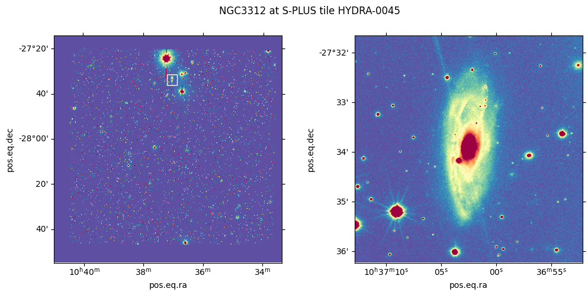
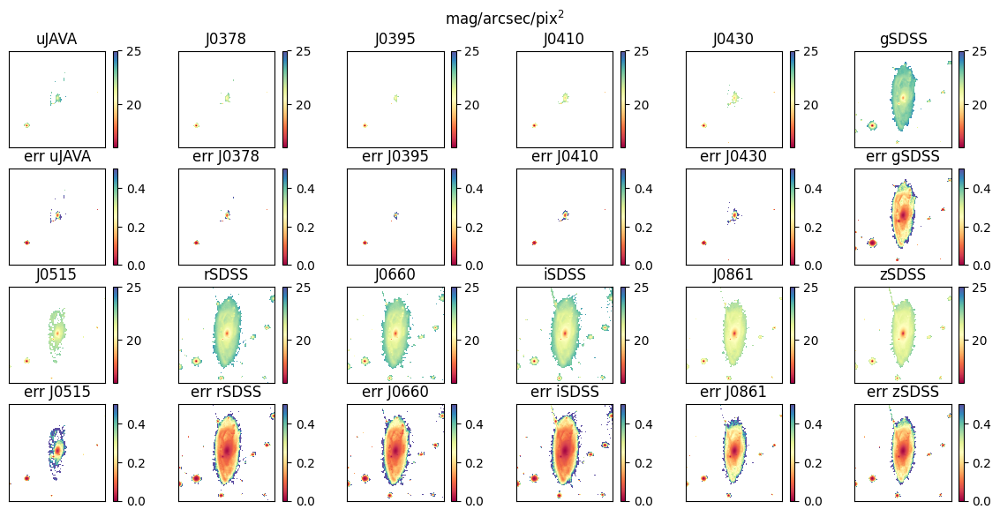
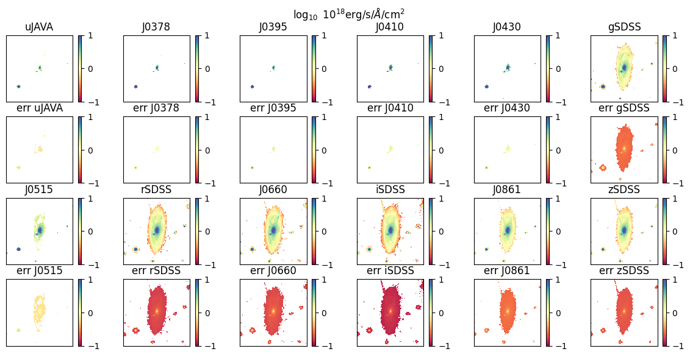
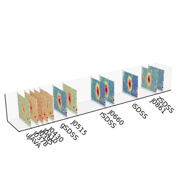
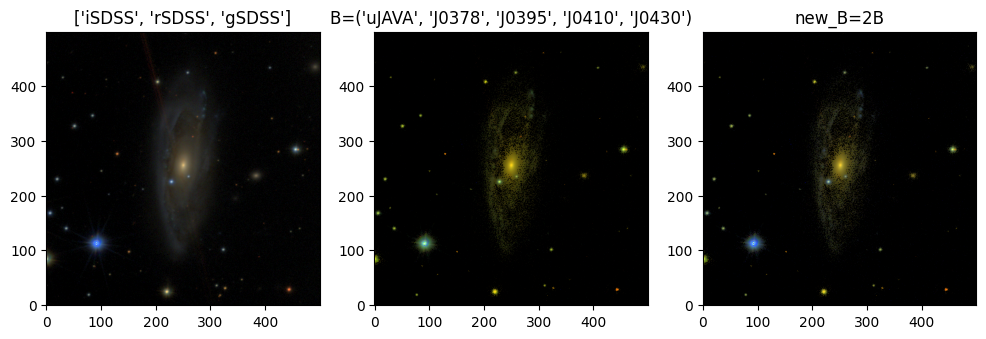
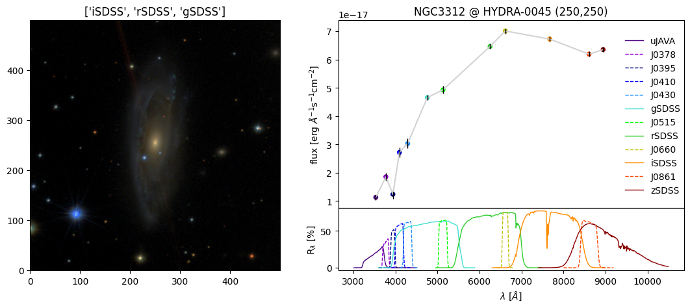
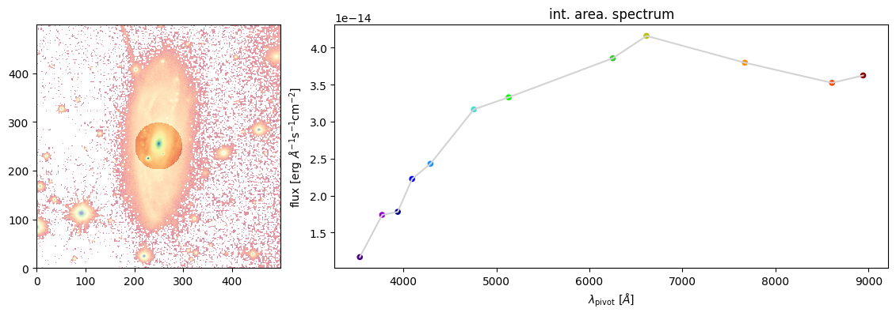

.. _jupyter_scubes:

Jupyter Notebook example
========================

:download:`Download this notebook <nb_example.ipynb>`.

.. toctree::
    :maxdepth: 2
    :glob:

Creating a cube
---------------

This example will create a **500x500** pixels cube with the 12-bands
images from **S-PLUS TILE HYDRA-0045** for the *NGC3312* galaxy. The
stamps are made from a cropped 500x500 pixels area located at **S-PLUS
TILE** mentioned before, centered at coordinates RA *10h37m02.5s* and
DEC *-27d33’56"*.

   NGC3312 crop at HYDRA-0045 S-PLUS tile

The ``scubes`` entry-point script will download the 12-band stamps and
calculate the fluxes and errors of each image. The images are zero-point
calibrated based on the **S-PLUS iDR4** (*scubes package includes zp
data*) values, but they are **not corrected for Galactic extinction**.
The resultant files will be created at directory *workdir*.

The program also could use **SExtractor** in order to create a spatial
mask of stars, attempting to remove the areas enclosed by the brightest
ones along the FOV (*-M* optional argument). To use this option, do not
forget to include the **SExtractor** executable path using the option
*-x*. An example of this usage could be find at: :ref:`jupyter_mask_stars`.

``scubes`` entry-point script help and usage:

.. code-block:: ipython3

    !scubes --help

.. parsed-literal::

    usage: scubes [-h] [-r] [-c] [-f] [-b BANDS [BANDS ...]] [-l SIZE] [-N]
                  [-w WORK_DIR] [-o OUTPUT_DIR] [-x SEXTRACTOR] [-p CLASS_STAR]
                  [-v] [-D] [-S SATUR_LEVEL] [-Z ZPCORR_DIR] [-z ZP_TABLE]
                  [-B BACK_SIZE] [-T DETECT_THRESH] [-U USERNAME] [-P PASSWORD]
                  [-M] [-I] [-F] [-R] [--version]
                  SPLUS_TILE RA DEC GALAXY_NAME
    
    ┌─┐   ┌─┐┬ ┬┌┐ ┌─┐┌─┐  | Create S-PLUS galaxies data cubes, a.k.a. S-CUBES. 
    └─┐───│  │ │├┴┐├┤ └─┐  | S-CUBES is an organized FITS file with data, errors, 
    └─┘   └─┘└─┘└─┘└─┘└─┘  | mask and metadata about some galaxy present on any 
    ---------------------- + S-PLUS observed tile. Any problem contact:
    
       Eduardo Alberto Duarte Lacerda <dhubax@gmail.com>, Fabio Herpich <fabiorafaelh@gmail.com>
    
    The input values of RA and DEC will be converted to degrees using the 
    scubes.utilities.io.convert_coord_to_degrees(). All scripts with RA 
    and DEC inputs parse angles in two different units:
    
    - **hourangle**: using *hms* divisors; Ex: *10h37m2.5s*
    - **degrees**: using *:* or *dms*  divisors; Ex: *10:37:2.5* or *10d37m2.5s*
    
    Note that *10h37m2.5s* is a totally different angle from *10:37:2.5* 
    (*159.26 deg* and *10.62 deg* respectively).
    
    positional arguments:
      SPLUS_TILE                  Name of the S-PLUS tile
      RA                          Galaxy's right ascension
      DEC                         Galaxy's declination
      GALAXY_NAME                 Galaxy's name
    
    options:
      -h, --help                  show this help message and exit
      -r, --redo                  Enable redo mode to overwrite final cubes.
                                  Default value is False
      -c, --clean                 Clean intermediate files after processing.
                                  Default value is False
      -f, --force                 Force overwrite of existing files. Default value
                                  is False
      -b BANDS [BANDS ...], --bands BANDS [BANDS ...]
                                  List of S-PLUS bands (space separated). Default
                                  value is ['U', 'F378', 'F395', 'F410', 'F430',
                                  'G', 'F515', 'R', 'F660', 'I', 'F861', 'Z']
      -l SIZE, --size SIZE        Size of the cube in pixels. If size is a odd
                                  number, the program will choose the closest even
                                  integer. Default value is 500
      -N, --no_interact           Run only the automatic stars mask (a.k.a. do not
                                  check final mask) Default value is False
      -w WORK_DIR, --work_dir WORK_DIR
                                  Working directory. Default value is /storage/hdd
                                  /backup/dhubax/dev/astro/splus/s-cubes/workdir
      -o OUTPUT_DIR, --output_dir OUTPUT_DIR
                                  Output directory. Default value is /storage/hdd/
                                  backup/dhubax/dev/astro/splus/s-cubes/workdir
      -x SEXTRACTOR, --sextractor SEXTRACTOR
                                  Path to SExtractor executable. Default value is
                                  sex
      -p CLASS_STAR, --class_star CLASS_STAR
                                  SExtractor CLASS_STAR parameter for star/galaxy
                                  separation. Default value is 0.25
      -v, --verbose               Verbosity level.
      -D, --debug                 Enable debug mode. Default value is False
      -S SATUR_LEVEL, --satur_level SATUR_LEVEL
                                  Saturation level for the png images. Default
                                  value is 1600.0
      -Z ZPCORR_DIR, --zpcorr_dir ZPCORR_DIR
                                  Zero-point correction directory. Default value
                                  is /home/lacerda/.local/lib/python3.10/site-
                                  packages/scubes/data/zpcorr_iDR4
      -z ZP_TABLE, --zp_table ZP_TABLE
                                  Zero-point table. Default value is
                                  /home/lacerda/.local/lib/python3.10/site-
                                  packages/scubes/data/iDR4_zero-points.csv
      -B BACK_SIZE, --back_size BACK_SIZE
                                  Background mesh size for SExtractor. Default
                                  value is 64
      -T DETECT_THRESH, --detect_thresh DETECT_THRESH
                                  Detection threshold for SExtractor. Default
                                  value is 1.1
      -U USERNAME, --username USERNAME
                                  S-PLUS Cloud username.
      -P PASSWORD, --password PASSWORD
                                  S-PLUS Cloud password.
      -M, --mask_stars            Run SExtractor to auto-identify stars on stamp.
                                  Default value is False
      -I, --det_img               Downloads detection image for the stamp. Needed
                                  if --mask_stars is active. Default value is
                                  False
      -F, --estimate_fwhm         Runs SExtractor two times estimating the
                                  SEEING_FWHM of the detection image. Default
                                  value is False
      -R, --remove_downloaded_data
                                  Remove the downloaded data from splusdata at the
                                  end of the run. Default value is False
      --version                   show program's version number and exit

The call to the entry-point script ``scubes`` to this example would be:

*Do not forget to change YOURUSER and YOURPASS for your credentials at
S-PLUS Cloud.*

.. code-block:: ipython3

    !scubes -fR -w . -U YOURUSER -P YOURPASS -l 500 -- HYDRA-0045 10h37m02.5s -27d33\'56\" NGC3312

.. parsed-literal::

    NGC3312 @ HYDRA-0045 - downloading: 100%|███████| 12/12 [00:29<00:00,  2.42s/it]
    WARNING: FITSFixedWarning: 'datfix' made the change 'Set DATE-OBS to '2017-02-19' from MJD-OBS'. [astropy.wcs.wcs]
    [2024-05-26T19:17:59.990086] - scubes: Reading ZPs table: /home/lacerda/.local/lib/python3.10/site-packages/scubes/data/iDR4_zero-points.csv
    [2024-05-26T19:17:59.993503] - scubes: Getting ZP corrections for the S-PLUS bands...
    [2024-05-26T19:17:59.998823] - scubes: Calibrating stamps...
    /home/lacerda/.local/lib/python3.10/site-packages/scubes/core.py:523: RuntimeWarning: cdelt will be ignored since cd is present
      nw.wcs.cdelt[:2] = w.wcs.cdelt
    [2024-05-26T19:18:00.781773] - scubes: Cube successfully created!
    [2024-05-26T19:18:00.781793] - scubes: Removing downloaded data

How to read a cube
------------------

A cube resultant from ``scubes`` script is stored using FITS format and
is called **SCUBE**. In order to help the *user*, ``scubes`` package
implements a utility class to read the **SCUBE**. This class implements
the method ``lRGB_image()`` to create Lupton RGB images.

Below an example of the ``scubes.utilities.read_scube()`` usage:

.. code-block:: python

    from os.path import join
    from scubes.utilities.readscube import read_scube
    
    SNAME = f'NGC3312'
    filename = join(SNAME, f'{SNAME}_cube.fits')
    
    scube = read_scube(filename)

Headers
-------

The *PRIMARY HEADER* (``scube.primary_header``) contains information
about the object, all processed by the code. The *DATA HEADER*
(``scube.data_header``) otherwise, includes information about the tile
observation and a 3D World Coordinate System (WCS) information, which is
converted to a 2D ``astropy.wcs.WCS()`` instance in the variable
``scube.wcs``.

.. code-block:: python

    scube.primary_header

.. parsed-literal::

    SIMPLE  =                    T / conforms to FITS standard                      
    BITPIX  =                    8 / array data type                                
    NAXIS   =                    0 / number of array dimensions                     
    EXTEND  =                    T                                                  
    TILE    = 'HYDRA-0045'                                                          
    GALAXY  = 'NGC3312 '                                                            
    SIZE    =                  500 / Side of the stamp in pixels                    
    X0TILE  =             5683.973                                                  
    Y0TILE  =             8849.952                                                  
    RA      =   159.26041666666666                                                  
    DEC     =  -27.565555555555555                                                  

.. code-block:: python

    scube.data_header

.. parsed-literal::

    XTENSION= 'IMAGE   '           / Image extension                                
    BITPIX  =                  -64 / array data type                                
    NAXIS   =                    3 / number of array dimensions                     
    NAXIS1  =                  500                                                  
    NAXIS2  =                  500                                                  
    NAXIS3  =                   12                                                  
    PCOUNT  =                    0 / number of parameters                           
    GCOUNT  =                    1 / number of groups                               
    COMMENT   FITS (Flexible Image Transport System) format is defined in 'Astronomy
    COMMENT   and Astrophysics', volume 376, page 359; bibcode: 2001A&A...376..359H 
    EQUINOX =        2000.00000000 / Mean equinox                                   
    MJD-OBS =   5.780300000000E+04 / [d] MJD of observation                         
    RADESYS = 'ICRS    '           / Equatorial coordinate system                   
    CTYPE1  = 'RA---TAN'           / Coordinate type code                           
    CUNIT1  = 'deg     '           / Units of coordinate increment and value        
    CRVAL1  =   1.592920354170E+02 / Coordinate value at reference point            
    CRPIX1  = 6.850000000000000E+01 / Pixel coordinate of reference point           
    CD1_1   =  -1.527777777778E-04 / Linear projection matrix                       
    CD1_2   =   0.000000000000E+00 / Linear projection matrix                       
    CTYPE2  = 'DEC--TAN'           / Coordinate type code                           
    CUNIT2  = 'deg     '           / Units of coordinate increment and value        
    CRVAL2  =  -2.807726741670E+01 / Coordinate value at reference point            
    CRPIX2  = -3.097500000000000E+03 / Pixel coordinate of reference point          
    CD2_1   =   0.000000000000E+00 / Linear projection matrix                       
    CD2_2   =   1.527777777778E-04 / Linear projection matrix                       
    EXPTIME =                  1.0 / Normalized exposure time                       
    SATURATE=   2.830922105506E+02 / Saturation Level (ADU)                         
    COMMENT                                                                         
    SOFTNAME= 'SWarp   '           / The software that processed those data         
    SOFTVERS= '2.38.0  '           / Version of the software                        
    SOFTDATE= '2017-01-17'         / Release date of the software                   
    SOFTAUTH= '2010-2012 IAP/CNRS/UPMC' / Maintainer of the software                
    SOFTINST= 'IAP  http://www.iap.fr' / Institute                                  
    COMMENT                                                                         
    AUTHOR  = 'jype    '           / Who ran the software                           
    ORIGIN  = 't80s-jype4'         / Where it was done                              
    DATE    = '2019-01-31T17:38:35' / When it was started (GMT)                     
    COMBINET= 'WEIGHTED'           / COMBINE_TYPE config parameter for SWarp        
    COMMENT                                                                         
    COMMENT  Propagated FITS keywords                                               
    OBJECT  = 'NGC3312 '           / name of observed object                        
    TELESCOP= 'T80     '           / Telescope Model                                
    INSTRUME= 'T80Cam  '           / Custom. Name of instrument                     
    COMMENT                                                                         
    COMMENT  Axis-dependent config parameters                                       
    RESAMPT1= 'LANCZOS3'           / RESAMPLING_TYPE config parameter               
    CENTERT1= 'MANUAL  '           / CENTER_TYPE config parameter                   
    PSCALET1= 'MANUAL  '           / PIXELSCALE_TYPE config parameter               
    RESAMPT2= 'LANCZOS3'           / RESAMPLING_TYPE config parameter               
    CENTERT2= 'MANUAL  '           / CENTER_TYPE config parameter                   
    PSCALET2= 'MANUAL  '           / PIXELSCALE_TYPE config parameter               
            STATS 2019-01-31T14:40:30.666269                                        
    HIERARCH OAJ QC NCMODE = 0.0 / Mode (ADU)                                       
    HIERARCH OAJ QC NCMIDPT = 0.0001 / Level estim (ADU)                            
    HIERARCH OAJ QC NCMIDRMS = 0.000599999999999999 / rms level (ADU)               
    HIERARCH OAJ QC NCNOISE = 0.0073 / Noise estim (ADU)                            
    HIERARCH OAJ QC NCNOIRMS = 0.0005 / rms noise estim (ADU)                       
            FWHM ESTIM 2019-01-31T14:41:27.247078                                   
    HIERARCH OAJ PRO FWHMSEXT = 1.578 / FWHM arcsec estimated with SE               
    HIERARCH OAJ PRO FWHMSRMS = 0.07199999999999999 / rms in FWHM with SE           
    HIERARCH OAJ PRO FWHMBETA = 2.332319974899292 / PSFex beta                      
    HIERARCH OAJ PRO FWHMNSTARS = 405 / PSFex nstars                                
    HIERARCH OAJ PRO ELLIPMEAN = 0.02642080001533031 / PSFex Ellip                  
    PIXSCALE=                 0.55                                                  
    FILENAME= 'HYDRA-0045_U_swp.fits'                                               
    TEXPOSED=               1362.0                                                  
    TEXPSUM =               1362.0 / Maximum equivalent exposure time (s)           
    HIERARCH OAJ PRO PIPVERS = '0.9.9   '                                           
    HIERARCH OAJ PRO REFIMAGE = 'HYDRA_C-20170328-044356_proc' / Reference image for
    HIERARCH OAJ PRO REFAIRMASS = 1.080421306670953 / Reference image airmass       
    HIERARCH OAJ PRO REFDATEOBS = '2017-03-28T04:39:52.019000' / Reference image dat
    HIERARCH OAJ PRO SWCMB1 = 'HYDRA_C-20170219-055302_proc'                        
    HIERARCH OAJ PRO SWSCALE1 = 0.004404859185018                                   
    HIERARCH OAJ PRO SWCMB2 = 'HYDRA_C-20170219-055728_proc'                        
    HIERARCH OAJ PRO SWSCALE2 = 0.004405737992425                                   
    HIERARCH OAJ PRO SWCMB3 = 'HYDRA_C-20170219-060145_proc'                        
    HIERARCH OAJ PRO SWSCALE3 = 0.004423817580924                                   
    HIERARCH OAJ PRO SWCMB4 = 'HYDRA_C-20170328-043935_proc'                        
    HIERARCH OAJ PRO SWSCALE4 = 0.00405233218495                                    
    HIERARCH OAJ PRO SWCMB5 = 'HYDRA_C-20170328-044356_proc'                        
    HIERARCH OAJ PRO SWSCALE5 = 0.00404267877143                                    
    HIERARCH OAJ PRO SWCMB6 = 'HYDRA_C-20170328-044814_proc'                        
    HIERARCH OAJ PRO SWSCALE6 = 0.00407020637223                                    
    HISTORY Image was compressed by CFITSIO using scaled integer quantization:      
    HISTORY   q = 4.000000 / quantized level scaling parameter                      
    HISTORY 'SUBTRACTIVE_DITHER_1' / Pixel Quantization Algorithm                   
    CHECKSUM= 'bC4fbC4fbC4fbC4f'   / HDU checksum updated 2019-01-31T17:52:34       
    DATASUM = '1624960924'         / data unit checksum updated 2019-01-31T17:52:34 
    X01TILE =                249.5 / Center position                                
    Y01TILE =                249.5 / Center position                                
    X0TILE  =             5683.973 / Center position                                
    Y0TILE  =             8849.952 / Center position                                
    TILE    = 'HYDRA-0045'                                                          
    WCSAXES =                    3 / Number of coordinate axes                      
    PC1_1   =  -0.0001527777777778 / Coordinate transformation matrix element       
    PC2_2   =   0.0001527777777778 / Coordinate transformation matrix element       
    CDELT1  =                 1.0  / Coordinate increment at reference point        
    CDELT2  =                 1.0  / Coordinate increment at reference point        
    LONPOLE =                180.0 / [deg] Native longitude of celestial pole       
    LATPOLE =                 90.0 / [deg] Native latitude of celestial pole        
    MJDREF  =                  0.0 / [d] MJD of fiducial time                       
    DATE-OBS= '2017-02-19'         / ISO-8601 time of observation                   
    CRPIX3  =                  0.0 / Pixel coordinate of reference point            
    CDELT3  =                  1.0 / Coordinate increment at reference point        
    CRVAL3  =                  0.0 / Coordinate value at reference point            
    EXTNAME = 'DATA    '           / Name of the extension                          
    BUNIT   = 'erg / (Angstrom s cm2)' / Physical units of the array values         
                                                                                    
                                                                                    

2D WCS instance:

.. code-block:: python

    scube.wcs

.. parsed-literal::

    /home/lacerda/.local/lib/python3.10/site-packages/astropy/wcs/wcs.py:3137: RuntimeWarning: cdelt will be ignored since cd is present
      description.append(s.format(*self.wcs.cdelt))

.. parsed-literal::

    WCS Keywords
    
    Number of WCS axes: 2
    CTYPE : 'RA---TAN'  'DEC--TAN'  
    CRVAL : 159.292035417  -28.0772674167  
    CRPIX : 68.5  -3097.5  
    PC1_1 PC1_2  : -0.0001527777777778  0.0  
    PC2_1 PC2_2  : 0.0  0.0001527777777778  
    CDELT : 1.0  1.0  
    NAXIS : 500  500  12

Filters information
-------------------

``scubes`` includes some information about the filters used to obtain
S-PLUS images. The script is called ``scubes_filters`` and the data is
obtained from `S-PLUS Filters Transmission Curve
Calculator <https://github.com/splus-collab/splus_filters%3E>`__, made
by Fabio Herpich.

.. code-block:: ipython3

    !scubes_filters --decimals 2

.. parsed-literal::

    filter central_wave delta_wave trapz_wave trapz_width mean_wave mean_width mean_1_wave mean_1_width pivot_wave alambda_av
    ------ ------------ ---------- ---------- ----------- --------- ---------- ----------- ------------ ---------- ----------
     uJAVA      3576.59     324.89    3542.14      322.83   3542.14     322.83     3541.97       322.48    3533.28       1.61
     J0378      3770.67     150.99    3774.01      135.96   3774.01     135.96     3773.98       135.75    3773.16       1.52
     J0395      3940.67      102.8    3941.09      100.78   3941.09     100.78     3941.07       100.66     3940.7       1.46
     J0410      4094.08     200.31    4096.24      193.35   4096.24     193.35     4096.21       193.12    4094.93        1.4
     J0430      4292.02     200.16    4293.38      195.07   4293.38     195.07     4293.34       194.82    4292.11       1.33
     gSDSS      4774.03    1505.46     4821.1     1312.44    4821.1    1312.44     4821.07      1312.17    4758.49        1.2
     J0515      5132.82     207.06    5134.22      203.61   5134.22     203.61      5134.2       203.48    5133.13        1.1
     rSDSS      6274.74    1436.69    6295.69     1274.09   6295.69    1274.09     6295.67      1273.72    6251.83       0.86
     J0660      6613.99     147.28    6614.32      146.67   6614.32     146.67      6614.3       146.52    6613.88        0.8
     iSDSS       7702.5    1506.85    7709.96      1438.1   7709.96     1438.1     7709.81      1437.21    7670.61       0.65
     J0861      8611.48     409.69    8609.86      401.91   8609.87     401.91     8609.84       401.53    8607.25       0.54
     zSDSS       8881.7     1270.5    8985.81     1308.49   8985.81    1308.49     8986.54       1307.7    8941.48       0.51

The class ``scube`` also makes available some information about the
filters, such as:

::

   scube.filters: filters names
   scube.pivot_wave: pivot wavelenghts
   scube.central_wave: central wavelenghts

.. code-block:: python

    for _f, _p, _c in zip(scube.filters, scube.pivot_wave, scube.central_wave):
        print(f'filter: {_f} wave(pivot, central): ({_p:.2f}, {_c:.2f})')

.. parsed-literal::

    filter: uJAVA wave(pivot, central): (3533.28, 3576.59)
    filter: J0378 wave(pivot, central): (3773.16, 3770.67)
    filter: J0395 wave(pivot, central): (3940.70, 3940.67)
    filter: J0410 wave(pivot, central): (4094.93, 4094.08)
    filter: J0430 wave(pivot, central): (4292.11, 4292.02)
    filter: gSDSS wave(pivot, central): (4758.49, 4774.03)
    filter: J0515 wave(pivot, central): (5133.13, 5132.82)
    filter: rSDSS wave(pivot, central): (6251.83, 6274.74)
    filter: J0660 wave(pivot, central): (6613.88, 6613.99)
    filter: iSDSS wave(pivot, central): (7670.61, 7702.50)
    filter: J0861 wave(pivot, central): (8607.25, 8611.48)
    filter: zSDSS wave(pivot, central): (8941.48, 8881.70)

More metadata about the **SCUBE** cube, such as the *exposure times,
gains, PSF FWHM and the date of the observation* can be found with
``scube.metadata``:

.. code-block:: python

    scube.metadata

.. parsed-literal::

    FITS_rec([('uJAVA', 3576.5900319 , 3533.28150603, 1302.99580147, 2651.74575679, 1.4238565 , '2017-02-19'),
              ('J0378', 3770.66765668, 3773.16495619, 1266.43687077, 2590.53003934, 1.24601953, '2017-02-19'),
              ('J0395', 3940.66900669, 3940.69812172,  680.64843148, 1401.35102734, 1.18031096, '2017-02-19'),
              ('J0410', 4094.0795908 , 4094.92800733,  345.42806559,  706.83367717, 1.13351701, '2017-02-19'),
              ('J0430', 4292.0201202 , 4292.10579006,  278.90845694,  570.57617371, 1.14671147, '2017-02-19'),
              ('gSDSS', 4774.02604026, 4758.4878587 ,  191.4341835 ,  370.91141421, 1.2285185 , '2017-02-19'),
              ('J0515', 5132.82097321, 5133.13247975,  299.46581613,  610.78047227, 1.10798045, '2017-02-19'),
              ('rSDSS', 6274.74334743, 6251.83097429,  195.74024342,  396.72506048, 1.09843247, '2017-02-19'),
              ('J0660', 6613.99318993, 6613.87556039, 1430.33833785, 2904.99319306, 1.07404553, '2017-02-19'),
              ('iSDSS', 7702.49932499, 7670.61445983,  272.39806574,  560.98501139, 1.03689299, '2017-02-19'),
              ('J0861', 8611.48166482, 8607.25421702,  479.32598833,  984.36649508, 1.083632  , '2017-02-19'),
              ('zSDSS', 8881.70071701, 8941.47606623,  275.62079939,  566.9703096 , 1.03092001, '2017-02-19')],
             dtype=(numpy.record, [('FILTER', 'S5'), ('CENTWAVE', '>f8'), ('PIVOTWAVE', '>f8'), ('EXPTIME', '>f8'), ('GAIN', '>f8'), ('PSFFWHM', '>f8'), ('DATE-OBS', 'S10')]))

Images plot
-----------

This example below plots the images of the magnitudes and errors from
all filters, calculated by ``scubes`` package. The of the flux and
errors by default are in erg/s/:math:`\unicode{x212B}`/cm\ :math:`^2`:

::

   scube.flux__lyx and scube.eflux__lyx

the ``lyx`` suffix points the dimensions of the array (Lambda, Y, X).
``scube`` class also create arrays with the value converted to
mag/arcsec/pix\ :math:`^2`:

::

   scube.mag__lyx and scube.emag__lyx

.. code-block:: python

    import numpy as np
    import matplotlib.pyplot as plt
    import matplotlib.ticker as ticker

.. code-block:: python

    f__byx = scube.mag__lyx
    ef__byx = scube.emag__lyx
    weimask__yx = scube.weimask__yx
    filters_names = scube.metadata['FILTER']
    nb, ny, nx = f__byx.shape
    nrows = 2
    ncols = int(nb/nrows)
    f, ax_arr = plt.subplots(2*nrows, ncols)
    f.set_size_inches(12, 6)
    f.subplots_adjust(left=0.01, right=0.95, bottom=0.05, top=0.90, hspace=0.22, wspace=0.13)
    k = 0
    for ir in range(nrows):
        for ic in range(ncols):
            img = f__byx[k]
            vmin, vmax = 16, 25
            ax = ax_arr[ir*2, ic]
            ax.set_title(filters_names[k])
            im = ax.imshow(img, origin='lower', cmap='Spectral', vmin=vmin, vmax=vmax)
            plt.colorbar(im, ax=ax)
            ax.xaxis.set_major_locator(ticker.NullLocator())
            ax.yaxis.set_major_locator(ticker.NullLocator())
    
            eimg = ef__byx[k]
            vmin, vmax = 0, 0.5
            ax = ax_arr[ir*2 + 1, ic]
            ax.set_title(f'err {filters_names[k]}')
            im = ax.imshow(eimg, origin='lower', cmap='Spectral', vmin=vmin, vmax=vmax)
            plt.colorbar(im, ax=ax)
            ax.xaxis.set_major_locator(ticker.NullLocator())
            ax.yaxis.set_major_locator(ticker.NullLocator())
    
            k += 1
    f.suptitle(r'mag/arcsec/pix$^2$')

.. parsed-literal::

    Text(0.5, 0.98, 'mag/arcsec/pix$^2$')

.. code-block:: python

    f__byx = np.ma.log10(scube.flux__lyx) + 18
    ef__byx = np.ma.log10(scube.eflux__lyx) + 18
    weimask__yx = scube.weimask__yx
    filters_names = scube.metadata['FILTER']
    nb, ny, nx = f__byx.shape
    nrows = 2
    ncols = int(nb/nrows)
    f, ax_arr = plt.subplots(2*nrows, ncols)
    f.set_size_inches(12, 6)
    f.subplots_adjust(left=0.01, right=0.95, bottom=0.05, top=0.90, hspace=0.22, wspace=0.13)
    k = 0
    for ir in range(nrows):
        for ic in range(ncols):
            img = f__byx[k]
            vmin, vmax = np.percentile(img.compressed(), [5, 95])
            vmin, vmax = -1, 1
            ax = ax_arr[ir*2, ic]
            ax.set_title(filters_names[k])
            im = ax.imshow(img, origin='lower', cmap='Spectral', vmin=vmin, vmax=vmax)
            plt.colorbar(im, ax=ax)
            ax.xaxis.set_major_locator(ticker.NullLocator())
            ax.yaxis.set_major_locator(ticker.NullLocator())
            eimg = ef__byx[k]
            vmin, vmax = np.percentile(eimg.compressed(), [5, 95])
            vmin, vmax = -1, 1
            ax = ax_arr[ir*2 + 1, ic]
            ax.set_title(f'err {filters_names[k]}')
            im = ax.imshow(eimg, origin='lower', cmap='Spectral', vmin=vmin, vmax=vmax)
            plt.colorbar(im, ax=ax)
            ax.xaxis.set_major_locator(ticker.NullLocator())
            ax.yaxis.set_major_locator(ticker.NullLocator())
    
            k += 1
    f.suptitle(r'$\log_{10}$ 10$^{18}$erg/s/$\AA$/cm$^2$')

.. parsed-literal::

    Text(0.5, 0.98, '$\\log_{10}$ 10$^{18}$erg/s/$\\AA$/cm$^2$')

3D image
--------

.. code-block:: python

    import astropy.units as u
    
    xx, yy = np.meshgrid(range(scube.size), range(scube.size))
    FOV = 140*u.deg
    focal_lenght = 1/np.tan(FOV/2)
    print(f'FOV: {FOV}\nfocal lenght: {focal_lenght}')
    f = plt.figure()
    ax = f.add_subplot(projection='3d')
    for i, _w in enumerate(scube.pivot_wave):
        sc = ax.scatter(xx, yy, c=np.ma.log10(scube.flux__lyx[i]) + 18, 
                        zs=_w, s=1, edgecolor='none', vmin=-1, vmax=0.5, cmap='Spectral_r')
    ax.set_zticks(scube.pivot_wave)
    ax.set_zticklabels(scube.filters, rotation=-45)
    ax.set_proj_type('persp', focal_length=focal_lenght)
    ax.set_box_aspect(aspect=(7, 1, 1))
    ax.view_init(elev=20, azim=-125, vertical_axis='y')
    ax.set_xticks([])
    ax.set_yticks([])
    for spine in ax.spines.values():
        spine.set_visible(False)

.. parsed-literal::

    FOV: 140.0 deg
    focal lenght: 0.36397023426620245

RGB and Filters plot
--------------------

This series of examples below are using the Lupton RGB method of the
``scube`` module and some of the **data** stored by the ``scubes``
package in order to create a filters transmittance plot.

``scubes`` package implements various constants in ``scubes.constants``
module. This example below uses ``FILTER_NAMES_FITS``,
``FILTERS_COLORS`` and ``FILTER_TRANSMITTANCE`` data. The filters
transmittance curves are calculated by ``splus-filters`` package:

-  https://github.com/splus-collab/splus_filters

The ``scubes.utilities.read_scube.lRGB_image`` is a wrapper to
``astropy.visualization.make_lupton_rgb()`` that creates RGB images
using the **SCUBE** instantiated by ``scubes.utilities.read_scube``
class.

.. code-block:: python

    # RGB plot
    rgb_f = [1, 1, 1]
    pminmax = [5, 95]
    Q = 10
    stretch = 5
    im_max = 1
    minimum = (0, 0, 0)
    
    f, axArr = plt.subplots(1, 3)
    ax1, ax2, ax3 = axArr
    f.set_size_inches(12, 4)
    
    ###### original RGB from splus.data package
    rgb = ['iSDSS', 'rSDSS', 'gSDSS']
    rgb__yxb = scube.lRGB_image(rgb, rgb_f, pminmax, Q=Q, stretch=stretch, im_max=im_max, minimum=minimum)
    ax1.imshow(rgb__yxb, origin='lower')
    ax1.set_title(rgb)
    
    ###### improved RGB
    R_filters = 'iSDSS'
    G_filters = 'rSDSS'
    B_filters = tuple(scube.filters[0:5])
    rgb = [R_filters, G_filters, B_filters]
    rgb__yxb = scube.lRGB_image(rgb, rgb_f, pminmax, Q=Q, stretch=stretch, im_max=im_max, minimum=minimum)
    ax2.imshow(rgb__yxb, origin='lower')
    ax2.set_title(f'B={B_filters}')
    
    ###### improved RGB with contrast
    rgb_f = [1, 1, 2]
    R_filters = 'iSDSS'
    G_filters = 'rSDSS'
    B_filters = tuple(scube.filters[0:5])
    rgb = [R_filters, G_filters, B_filters]
    rgb__yxb = scube.lRGB_image(rgb, rgb_f, pminmax, Q=Q, stretch=stretch, im_max=im_max, minimum=minimum)
    ax3.imshow(rgb__yxb, origin='lower')
    ax3.set_title('new_B=2B')

.. parsed-literal::

    Text(0.5, 1.0, 'new_B=2B')

.. code-block:: python

    from matplotlib.gridspec import GridSpec
    
    from scubes.constants import FILTER_NAMES_FITS, FILTER_COLORS, FILTER_TRANSMITTANCE
    
    # central coords
    i_x0, i_y0 = scube.i_x0, scube.i_y0
    spec_pix_y, spec_pix_x = i_y0, i_x0
    
    # data
    logflux__l = np.ma.log10(scube.flux__lyx[:, i_y0, i_x0])  #.sum(axis=(1, 2)))
    logeflux__l = np.ma.log10(scube.eflux__lyx[:, i_y0, i_x0])
    flux__l = scube.flux__lyx[:, i_y0, i_x0]
    eflux__l = scube.eflux__lyx[:, i_y0, i_x0]
    bands__l = scube.pivot_wave
    
    # plot
    nrows = 4
    ncols = 2
    f = plt.figure()
    f.set_size_inches(12, 5)
    f.subplots_adjust(left=0, right=0.9)
    gs = GridSpec(nrows=nrows, ncols=ncols, hspace=0, wspace=0.03, figure=f)
    ax = f.add_subplot(gs[0:nrows - 1, 1])
    axf = f.add_subplot(gs[-1, 1])
    axrgb = f.add_subplot(gs[:, 0])
    
    # RGB image
    rgb__yxb = scube.lRGB_image(
        rgb=['iSDSS', 'rSDSS', 'gSDSS'], rgb_f=[1, 1, 1], 
        pminmax=[5, 95], Q=10, stretch=5, im_max=1, minimum=(0, 0, 0)
    )
    axrgb.imshow(rgb__yxb, origin='lower')
    axrgb.set_title(rgb)
    
    # filters transmittance
    filter_colors = []
    axf.sharex(ax)
    for k in scube.filters:
        _f = FILTER_TRANSMITTANCE[k]
        c = FILTER_COLORS[FILTER_NAMES_FITS[k]]
        filter_colors.append(c)
        lt = '--'
        if 'JAVA' in k or 'SDSS' in k:
            lt = '-'
        axf.plot(_f['wavelength'], _f['transmittance'], c=c, lw=1, ls=lt, label=k)
    axf.legend(loc=(0.82, 1.15), frameon=False)
    
    # spectrum 
    ax.set_title(f'{scube.galaxy} @ {scube.tile} ({spec_pix_x},{spec_pix_y})')
    ax.plot(bands__l, flux__l, ':', c='k')
    ax.scatter(bands__l, flux__l, c=np.array(filter_colors), s=0.5)
    ax.errorbar(x=bands__l,y=flux__l, yerr=eflux__l, c='k', lw=1, fmt='|')
    ax.plot(bands__l, flux__l, '-', c='lightgray')
    ax.scatter(bands__l, flux__l, c=np.array(filter_colors))
    
    ax.set_xlabel(r'$\lambda_{\rm pivot}\ [\AA]$', fontsize=10)
    ax.set_ylabel(r'flux $[{\rm erg}\ \AA^{-1}{\rm s}^{-1}{\rm cm}^{-2}]$', fontsize=10)
    axf.set_xlabel(r'$\lambda\ [\AA]$', fontsize=10)
    axf.set_ylabel(r'${\rm R}_\lambda\ [\%]$', fontsize=10)

.. parsed-literal::

    Text(0, 0.5, '${\\rm R}_\\lambda\\ [\\%]$')

.. code-block:: python

    # Contour plot example
    i_lambda = scube.filters.index('rSDSS')
    image__yx = scube.mag__lyx[i_lambda]
    contour_levels = [21, 23, 24]
    
    f = plt.figure()
    im = plt.imshow(image__yx, cmap='Spectral_r', origin='lower', vmin=16, vmax=25)
    plt.contour(image__yx, levels=contour_levels, colors=['k', 'gray', 'lightgray'])
    plt.colorbar(im)

.. parsed-literal::

    <matplotlib.colorbar.Colorbar at 0x726e7e063df0>

.. image:: images/nb_example_27_1.png

Distance from center
--------------------

With ``scube.pixel_distance__yx`` property, the user also can play with
distance masks, such as create integrated spectra. An example:

.. code-block:: python

    from matplotlib.gridspec import GridSpec
    
    max_dist = 50  # pixels
    mask__yx = scube.pixel_distance__yx > max_dist
    __lyx = (scube.n_filters, scube.n_y, scube.n_x)
    mask__lyx = np.broadcast_to(mask__yx, __lyx)
    integrated_flux__lyx = np.ma.masked_array(scube.flux__lyx, mask=mask__lyx, copy=True)
    
    f = plt.figure()
    f.set_size_inches(12, 4)
    f.subplots_adjust(left=0, right=0.9)
    gs = GridSpec(nrows=1, ncols=3, wspace=0.2, figure=f)
    ax = f.add_subplot(gs[1:])
    axmask = f.add_subplot(gs[0])
    img__yx = np.ma.masked_array(scube.mag__lyx[scube.filters.index('rSDSS')], mask=mask__yx, copy=True)
    im = axmask.imshow(img__yx, origin='lower', cmap='Spectral_r')
    axmask.imshow(scube.mag__lyx[scube.filters.index('rSDSS')], origin='lower', cmap='Spectral_r', alpha=0.5, vmin=16, vmax=25)
    bands__l = scube.pivot_wave
    flux__l = integrated_flux__lyx.sum(axis=(1,2))
    ax.plot(bands__l, flux__l, '-', c='lightgray')
    ax.scatter(bands__l, flux__l, c=np.array(filter_colors), s=20, label='')
    ax.set_xlabel(r'$\lambda_{\rm pivot}\ [\AA]$', fontsize=10)
    ax.set_ylabel(r'flux $[{\rm erg}\ \AA^{-1}{\rm s}^{-1}{\rm cm}^{-2}]$', fontsize=10)
    ax.set_title('int. area. spectrum')

.. parsed-literal::

    Text(0.5, 1.0, 'int. area. spectrum')

